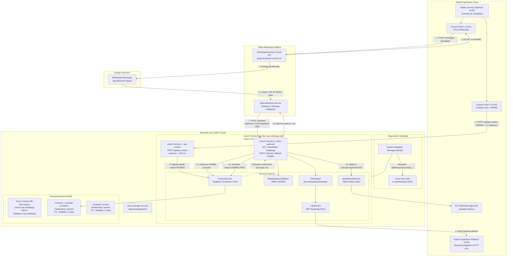
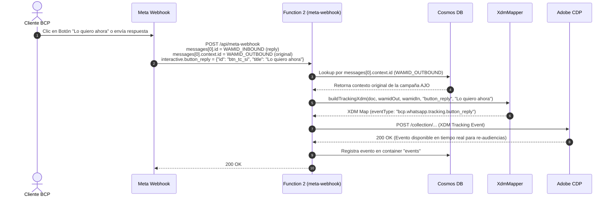
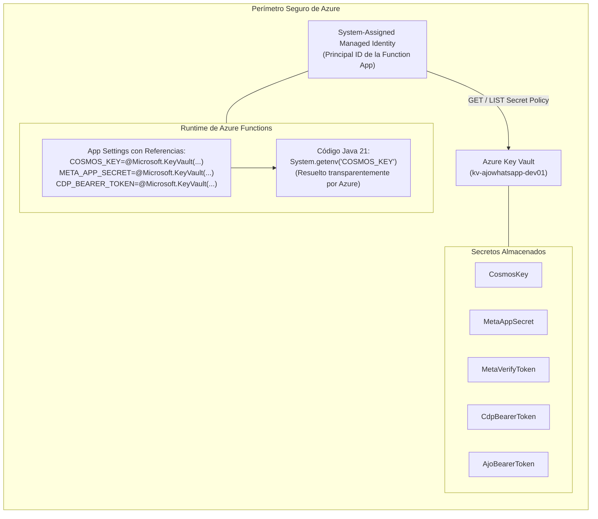

# BCP — Diagramas de Arquitectura y Flujos End-to-End

Documento técnico visual del middleware de correlación bidireccional entre **Adobe Journey Optimizer (AJO)**, **Meta WhatsApp Cloud Platform**, **Azure Functions**, **Azure Cosmos DB**, **Azure Key Vault** y **Adobe Experience Platform (AEP / CDP)**.

---

## 1. Diagrama de Arquitectura de Componentes



---

## 2. Diagrama de Secuencia 1: Flujo Outbound (Envío desde AJO)

```mermaid
sequenceDiagram
    autonumber
    actor Cliente as Cliente BCP
    participant AJO as AJO Journey
    participant MetaAPI as Meta Cloud API
    participant FX1 as Function 1 (ajo-context)
    participant KV as Azure Key Vault
    participant Cosmos as Cosmos DB (message-correlation)

    Note over AJO,MetaAPI: Paso A: Envío del Mensaje WhatsApp
    AJO->>MetaAPI: Custom Action 1: POST /v21.0/{phone-id}/messages (Template)
    MetaAPI-->>AJO: 200 OK: {"messages": [{"id": "wamid.HBgL..."}], "status": "accepted"}
    MetaAPI->>Cliente: Entrega mensaje en dispositivo WhatsApp

    Note over AJO,Cosmos: Paso B: Correlación de Contexto (Target &lt; 300 ms)
    AJO->>FX1: Custom Action 2: POST /api/ajo-context<br/>(wamid, customerId, journeyId, templateName, type)
    FX1->>KV: Resuelve COSMOS_KEY vía Managed Identity (cacheada)
    FX1->>Cosmos: Upsert Document: id=wamid, status=STORED, TTL=604800 (7 días)
    Cosmos-->>FX1: 200/201 Item creado
    FX1-->>AJO: 200 OK: {"status": "SUCCESS", "correlationId": "uuid...", "elapsedMs": 45}
```

---

## 3. Diagrama de Secuencia 2: Flujo Inbound Delivery (Callback de Meta)

```mermaid
sequenceDiagram
    autonumber
    actor Cliente as Cliente BCP
    participant MetaWH as Meta Webhook
    participant FX2 as Function 2 (meta-webhook)
    participant KV as Azure Key Vault
    participant Cosmos as Cosmos DB
    participant Xdm as XdmMapper
    participant CDP as Adobe CDP (Streaming)
    participant AJO as AJO Webhook (Native)

    Cliente->>MetaWH: Recibe / Lee mensaje (delivered / read)
    MetaWH->>FX2: POST /api/meta-webhook<br/>Header: X-Hub-Signature-256<br/>Body: statuses[0].id = WAMID_OUTBOUND, status = delivered

    FX2->>KV: Valida firma HMAC-SHA256 con META_APP_SECRET
    alt Firma Inválida
        FX2-->>MetaWH: 403 Forbidden
    else Firma Válida
        FX2->>Cosmos: Lookup /wamid (statuses[0].id)
        alt Documento Encontrado (Correlacionado)
            Cosmos-->>FX2: Retorna: customerId, journeyId, executionType
        else No Encontrado (Uncorrelated)
            Cosmos-->>FX2: null (evento huérfano temporal)
        end

        FX2->>Xdm: buildDeliveryXdm(doc, "delivered", wamid, timestamp)
        Xdm-->>FX2: XDM Map (_bcp.messaging.whatsapp.*)

        par Envío a Adobe CDP y Relay
            FX2->>CDP: POST /collection/... (XDM ExperienceEvent)
            CDP-->>FX2: 200 OK (Ingestado en el perfil 360 del cliente)
        and Relay a AJO si es NATIVE
            opt executionType == "NATIVE"
                FX2->>AJO: POST /journeys/webhooks/ingest/... (Payload original)
                AJO-->>FX2: 200/204 OK (Alimenta ajo_message_feedback_event_dataset)
            end
        end

        FX2->>Cosmos: updateEventStatus(wamid, "delivered", CORRELATED)
        FX2-->>MetaWH: 200 OK (Responde a Meta en &lt; 2s para evitar reintentos)
    end
```

---

## 4. Diagrama de Secuencia 3: Flujo Inbound Tracking (Botones y Respuestas)



---

## 5. Diagrama de Infraestructura y Secretos (Key Vault & Managed Identity)



---

## 6. Diagrama de CI/CD Pipeline (GitHub Actions)

```mermaid
graph LR
    DEV["Desarrollador BCP"] -->|"git push origin main"| GH["GitHub Repository"]

    subgraph GitHub_Actions["GitHub Actions Runner (ubuntu-latest)"]
        STEP1["1. Checkout Code (actions/checkout@v4)"]
        STEP2["2. Setup JDK 21 (actions/setup-java@v4 - temurin)"]
        STEP3["3. mvn clean test (17 pruebas automatizadas)"]
        STEP4["4. mvn package -DskipTests (Generación de Fat-Jar y Bindings)"]
        STEP5["5. Azure/functions-action@v1 (Deploy con Publish Profile)"]
    end

    GH --> STEP1
    STEP1 --> STEP2
    STEP2 --> STEP3
    STEP3 -->|"Tests OK (17/17)"| STEP4
    STEP4 --> STEP5

    subgraph Azure_Target["Azure Cloud"]
        AZ_FX["Azure Function App<br/>func-ajo-whatsapp-dev"]
    end

    STEP5 -->|"Publica paquetes y bindings"| AZ_FX
```



---

## 7. Tabla Resumen de Métricas y Contratos de Servicio (SLA)

| Métrica | Meta / Requisito BCP | Implementación en Middleware |
|---|---|---|
| **Latencia CA2 (Function 1)** | &lt; 300 ms (Timeout AJO en 750 ms) | Operación pura de Upsert en Cosmos DB (promedio ~40 ms). |
| **Tiempo de respuesta a Meta (Function 2)** | &lt; 2000 ms (Timeout Meta en 20 s) | Procesamiento directo en streaming y respuesta HTTP 200 inmediata. |
| **Throughput soportado** | &gt;= 200 TPS en bursts de campañas | Azure Functions Consumption Plan (auto-escalado) + Cosmos DB Serverless. |
| **Límite downstream CDP** | 30 RPS (PROD) / 100 RPS (DESA) | Throttling configurado a nivel de Journey Rate en AJO. |
| **Seguridad de Secretos** | Cero contraseñas en código o App Settings | Azure Key Vault con Managed Identity y Key Vault References. |
| **Retención operacional** | 7 días en Cosmos DB | TTL nativo de Azure Cosmos DB (`604800` segundos). Histórico permanente en AEP. |
